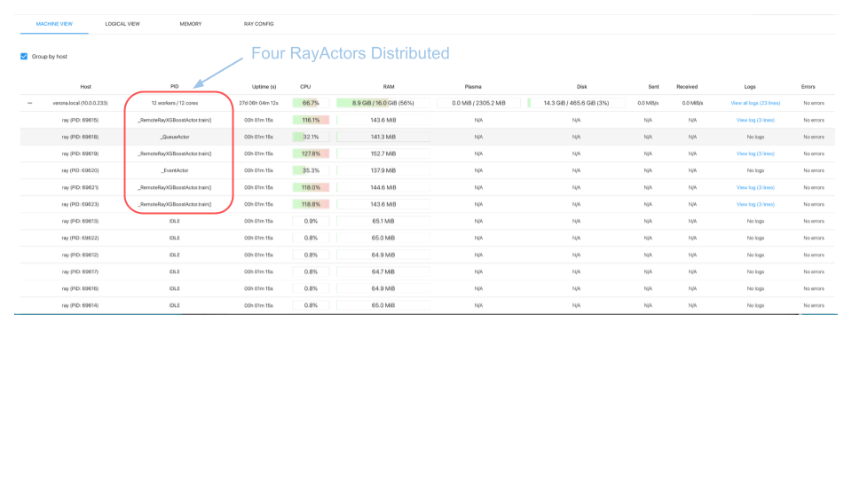

### A Credit Scoring Use Case for Loan Approval

#### Workshop Objective:

 * Load data and peruse the data
 * Declare and Define all Feast Primitives or First Class Objects (fco)
 * Create a Feature Store using Feast APIs
 * Train model using XGBoost fetching training data from Feast offline store
   * First using a single core on local host
   * Second, use Ray to do distribute training on four cores on localhost
 * Get data from Feast online store for credit score and loan approval 


### Vidoes Worth Watching
[Ray Tutorial](https://www.anyscale.com/events/2021/06/24/ray-core-tutorial)

[An Introduction to Ray for Scaling ML Workloads](https://www.anyscale.com/events/2021/08/18/an-introduction-to-ray-for-scaling-machine-learning-ml-workloads)


### Setup and Installation

### Step 1:
Activate the conda environment used in Module 1. This should have all the packages
installed in module 1.

``` conda activate feast_workshop ```
### Step 2:
``` ray --version ```

### Step 3: Create the Feast Feature Store 
```cd cd <your_cloned_git_dir>/feast_workshops/module_3/queries```

```python create_feature_store.py```

### Step 4: Train the XGBoost program on a single core or process

```python train_model.py```

### Step 5: Train the XGBoost on Ray's distributed training using multiple cores or processes

```python ray_train_model.py```



<hr style="border:3px solid gray"> </hr>

Alternatively, you could do all the above steps inside a Jupyter Notebook


```cd <your_cloned_git_dir>/feast_workshops/module_3/labs```

```jupyter lab```

And run labs 01 - 04 in that order
